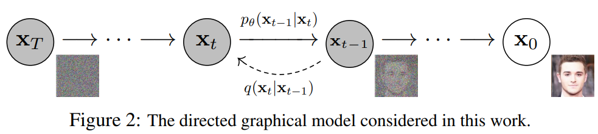

# Denoising Diffusion Probabilistic Models



## 1. Introduction

<!-- [ALGORITHM] -->

```BibTeX
@article{ho2020denoising,
  title={Denoising diffusion probabilistic models},
  author={Ho, Jonathan and Jain, Ajay and Abbeel, Pieter},
  journal={Advances in neural information processing systems},
  volume={33},
  pages={6840--6851},
  year={2020}
}
```

## 2. To extract the dataset, run the following script:
```shell
bash scripts/extract_dataset.sh
```

## 3. To train and test the model, run the following scripts:
```shell
bash scripts/train.sh
bash scripts/test.sh
```

## 4. To add Gaussian noise and test a facial image, run the following scripts:
```shell
bash scripts/add_noise.sh
bash scripts/test_face.sh
```

## 5. The entire code, dataset and pretrained weights can be downloaded at the following google drive link:
* [DDPM](https://drive.google.com/file/d/1fJIHvSD7tEmHYv6cbiYJYREb7JqxOG6P/view?usp=sharing)
